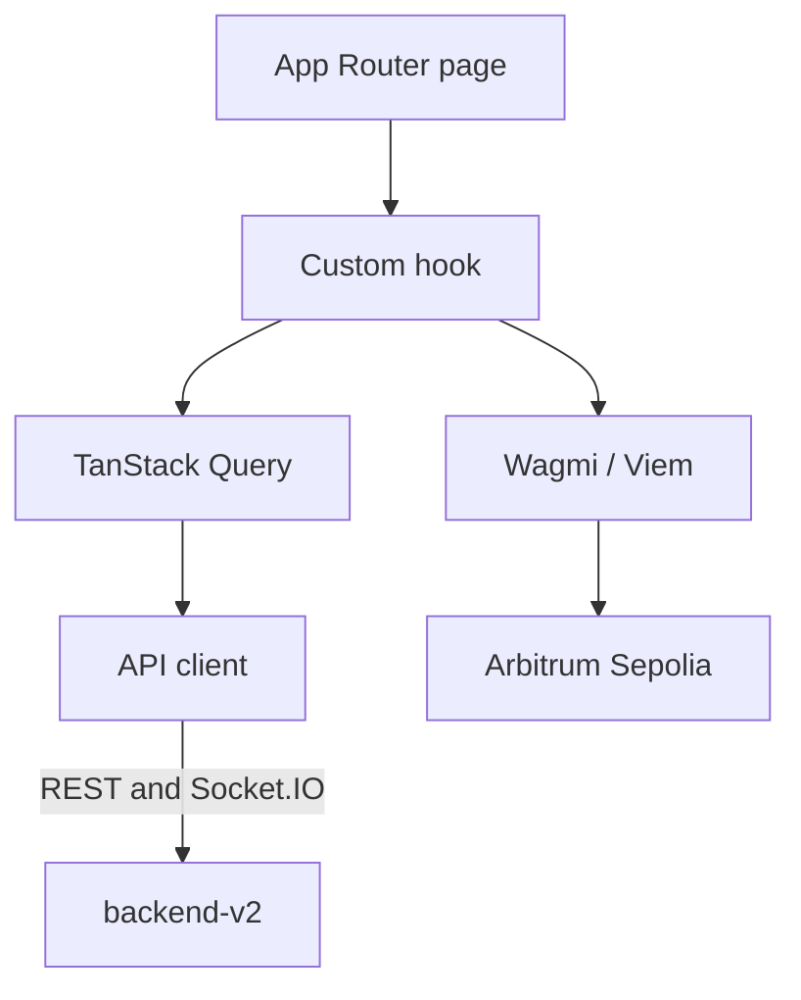

# Centuari Frontend

The user-facing web application for the Centuari decentralized lending
protocol. It provides wallet and Privy authentication, fixed-rate lend and
borrow flows, order-book views, collateral and health-factor views, portfolio
management, a testnet faucet, and a sandbox experience.

For the system map and current launch boundary, see the [Centuari umbrella
README](https://github.com/centuari-labs/centuari). The active protocol target
is Arbitrum Sepolia (`421614`); mainnet configuration exists in the codebase but
is not the current launch target.

## Tech stack

Next.js 16.2.7 (App Router, Turbopack) · React 19.2.6 · TypeScript · Tailwind
CSS v4 · shadcn/ui + Radix UI · TanStack Query v5 · React Hook Form + Zod ·
Privy · Wagmi v3 · Viem · Socket.IO · GSAP · Vitest · Playwright · Biome · pnpm

## Architecture



Application data flows through custom hooks and the centralized API client.
On-chain actions use Wagmi/Viem. Components should not fetch directly or own
business logic.

The provider stack is:

```text
PrivyProvider → QueryClientProvider → WagmiProvider →
EmbeddedWalletGuard → PriceProvider → UserDetailsProvider → app routes
```

## Requirements

- Node.js
- pnpm 10.23.0 (declared by `package.json`)
- A Privy application ID for the selected chain environment
- Contract addresses and ABI files generated by `smart-contract-revamp`

## Local setup

Create the local environment file, then fill in the required values:

```bash
cp .env.example .env.local
```

At minimum, set:

```dotenv
NEXT_PUBLIC_CHAIN_ENV=testnet
NEXT_PUBLIC_PRIVY_APP_ID=<testnet-privy-app-id>
BACKEND_URL=http://localhost:3000
NEXT_PUBLIC_WS_URL=http://localhost:3000
```

`NEXT_PUBLIC_CHAIN_ENV=testnet` selects Arbitrum Sepolia. Production builds
must set this explicitly; an unset value is not allowed to silently select a
chain. `NEXT_PUBLIC_PRIVY_APP_ID` is required for all environments. The current
runtime uses the backend API; although `.env.example` still lists
`NEXT_PUBLIC_USE_MOCK`, `src/lib/use-mock.ts` currently fixes `USE_MOCK` to
`false`, so changing that environment value does not enable mock mode. Mock
adapters are exercised by tests through module mocking.

The frontend also requires `NEXT_PUBLIC_HUB_DEPOSITOR_ADDRESS` and
`NEXT_PUBLIC_COLLATERAL_MANAGER_ADDRESS`. Those contract addresses are generated
into `.env.local` by the contract repository's sync script.

`NEXT_PUBLIC_RPC_URL` is optional; when empty, Wagmi uses its default transport
for the active chain.

## Contract addresses and ABIs

Do not hand-edit generated addresses or ABI files. From this repository's
directory, run the sync script owned by the sibling contract repository:

```bash
cd ../smart-contract-revamp
./bin/sync-to-services.sh --network=arb-sepolia
./bin/sync-to-services.sh --network=arb-sepolia --check
```

The sync writes the frontend's generated `.env.local` and ABI files. The
`--check` command is read-only and reports drift against the latest deployment.
Return to this repository before running the frontend commands below.

## Getting started

```bash
pnpm install
pnpm run dev
```

The development server listens on [http://localhost:3200](http://localhost:3200).

## Commands

```bash
pnpm run dev          # Next.js development server on port 3200
pnpm run build        # version check plus production build
pnpm run start        # production server on port 3200
pnpm run lint         # Biome check for src/
pnpm run typecheck    # TypeScript without emit
pnpm run test         # Vitest
pnpm run test:watch   # Vitest watch mode
pnpm run test:e2e     # Playwright Chromium tests
```

## Project conventions

- Keep data and business logic in hooks and adapters, not page components.
- Keep `components/ui/` read-only; compose domain components around shadcn
  primitives.
- Use React Hook Form + Zod for forms and validate external data at boundaries.
- Use the centralized query keys and fee utilities.
- Use Viem/Wagmi for on-chain interaction; do not add ethers.js.
- Use Biome's existing formatting and linting configuration.
