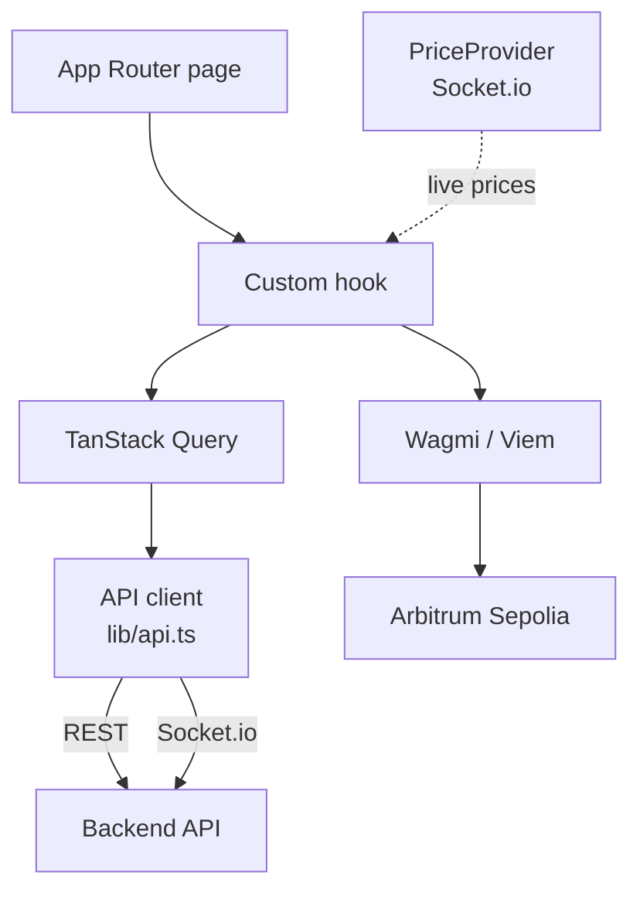

# Centuari · Frontend

The trading application for the Centuari decentralized lending protocol. A
Next.js 15 / React 19 app where users connect a wallet, deposit, place lend and
borrow orders against live order books, manage collateral and health factor, and
track their portfolio — all in real time.

This is one of nine services in the Centuari system. For the big picture, see the
[umbrella README](https://github.com/centuari-labs/centuari).

---

## What this app does

- **Wallet + auth** — Privy authentication with embedded-wallet support, wired to
  Wagmi v3 / Viem for on-chain actions on Arbitrum Sepolia.
- **Markets** — order-book views per `(loan token, maturity)` market with live
  updates over Socket.io.
- **Trading** — lend/borrow order flows (market + limit) with fee breakdowns and
  health-factor preview.
- **Portfolio** — positions, collateral flags, deposits/withdrawals, repayments.
- **Faucet, points, sandbox** — testnet token drip, rewards, and an experimentation surface.

## Tech stack

Next.js 15 (App Router, Turbopack) · React 19 · TypeScript (strict) ·
TailwindCSS v4 · shadcn/ui (new-york) + Radix UI · TanStack Query v5 · React Hook
Form + Zod v4 · Privy + Wagmi v3 · Viem · Socket.io · GSAP · Vitest + Playwright ·
Biome · pnpm

## Architecture



### Provider stack (top-down)

```
ThemeProvider → PrivyProvider → QueryClientProvider → WagmiProvider
  → EmbeddedWalletGuard → PriceProvider → TourProvider
```

### Data flow

```
Component → Custom Hook → TanStack Query → API Client → Backend REST / WebSocket
                                         → Wagmi / Viem → Blockchain
```

Components never fetch directly. All data access is funneled through a custom
hook (the data layer), which wraps a TanStack Query call against a centralized
API client, or a Wagmi/Viem call for on-chain actions.

### Project layout

```
src/
├── app/                # App Router pages + layouts
│   ├── market/         # order books + trading
│   ├── portfolio/      # positions dashboard
│   ├── faucet/         # testnet faucet
│   ├── points/         # rewards
│   ├── sandbox/        # experimentation surface
│   └── api/            # API proxy routes
├── components/
│   ├── ui/             # shadcn base components (read-only)
│   ├── market/ portfolio/ home/ icons/
│   └── centuari-*.tsx  # domain components composing shadcn primitives
├── hooks/              # 40+ custom hooks (the data layer)
├── lib/                # api client, utils, chain/token config, socket, fee-utils
├── types/              # shared domain types
└── contexts/           # React Context providers
```

## Conventions

- **Hooks are the data layer** — no fetch logic or business logic in components.
- **Mock adapter pattern** — data hooks have `*-adapter.api.ts` (real) and
  `*-adapter.mock.ts` (mock), selected by the `USE_MOCK` flag, so the whole UI
  runs without a backend.
- **shadcn is read-only** — never edit `components/ui/`; wrap with `centuari-*`.
- **CVA for variants**, `cn()` for conditional classes, Tailwind only (no inline
  styles), mobile-first responsive, dark mode via CSS variables.
- **Forms** = React Hook Form + Zod + shadcn `<Form>` primitives.
- **Centralized query keys** (`lib/query-keys.ts`) and a single fee source of
  truth (`lib/fee-utils.ts`) mirroring the matching engine.
- **Strict TypeScript** — no `any`, no `@ts-ignore`; Zod-validate all external
  data; type guards over casts.

## Contract addresses & ABIs

Addresses (`NEXT_PUBLIC_*` in `.env.local`) and ABIs (`abis/*.json`) are
gitignored and auto-generated by the smart-contract repo's
`bin/sync-to-services.sh` after every deploy. Code reads addresses through
`src/lib/chain-config.ts` (which throws at import if one is missing) and imports
ABIs as `import abi from "@/../abis/<Contract>.json"`. Don't hand-edit either;
verify freshness with `./bin/sync-to-services.sh --check`.

## Getting started

```bash
pnpm install
pnpm run dev          # next dev --turbopack -p 3200 → http://localhost:3200
```

Set `NEXT_PUBLIC_USE_MOCK=true` to run the UI against mock data with no backend.
For real data, point `NEXT_PUBLIC_WS_URL` / API base at a running backend-v2 and
set `NEXT_PUBLIC_PRIVY_APP_ID`.

## Commands

```bash
pnpm run dev          # dev server (port 3200)
pnpm run build        # production build
pnpm run test         # vitest run
pnpm run test:watch   # vitest watch
pnpm run test:e2e     # playwright (e2e/)
```

Biome v2.2.6: tab indent for JS/TS, double quotes. Run `pnpm run lint` before
committing.
